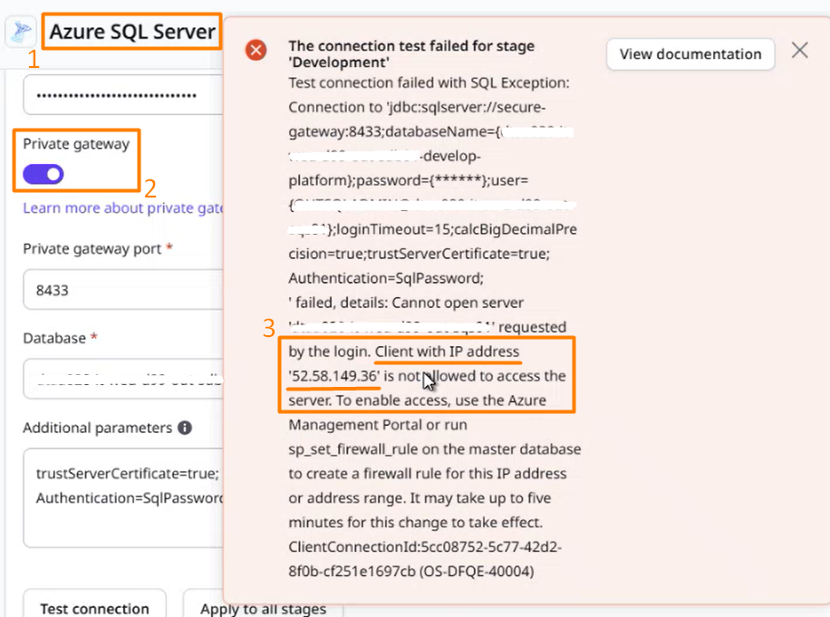
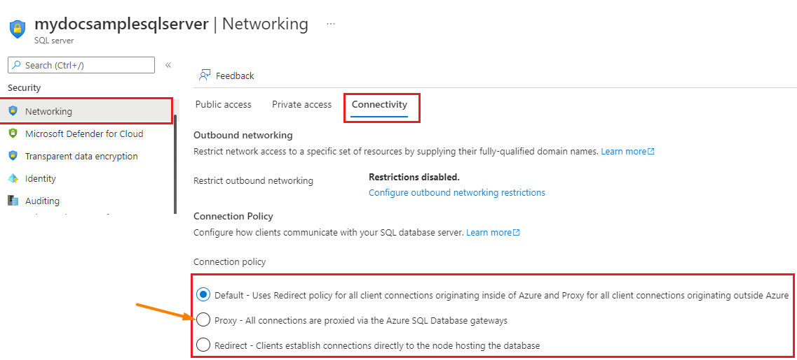

# Unable to create a connection via Private Gateway to Azure SQL - incorrect client IP

## Precautions

* This relates only to Azure SQL connections
* Error Code: OS-DFQE-40004

## Troubleshooting

When attempting to create a connection to a private database hosted on Azure SQL, via [Private gateway and Cloud Connector](https://success.outsystems.com/documentation/outsystems_developer_cloud/managing_outsystems_platform_and_apps/configure_a_private_gateway_to_your_network/), you may find an error mentioning a client IP is being blocked, and that IP belongs to our [public runtime IP address list](https://success.outsystems.com/documentation/outsystems_developer_cloud/managing_outsystems_platform_and_apps/allowlisting_odc_public_ip_addresses/).

Confirm the below steps:

* You are setting up an <strong>Azure SQL Server</strong> connection.
* You have Private gateway enabled.
* Error matches `Cannot open <server-name> requested by the login. Client with IP address <ip-address> is not allowed to access the server.`
* Confirm IP address is present in our[public runtime IP address list](https://success.outsystems.com/documentation/outsystems_developer_cloud/managing_outsystems_platform_and_apps/allowlisting_odc_public_ip_addresses/).

## Incident Resolution Measures

When not using a Private Gateway, it's expected that connections are established directly from our public runtime IP addresses - these are the IPs on which ODC apps are running in their respective regions.
On the other hand, when using a Private Gateway, the client IP address arriving at the database should be that of the system hosting the Cloud Connector, which is running on a private network and thus ensuring the access to the database remains private, which is the whole point of this architecture.

With the Cloud Connector running, requests from ODC side will first reach the Cloud Connector instance and these are then routed to the target endpoint.

The Cloud Connector instance is the middle-man, so the private endpoint (e.g. database) should be agnostic to the original source of requests (in this case, ODC apps) and thus it should never know the source IP address.

### Solution

Now, Azure SQL has a special setting called <strong>Connection Policy</strong>, which must be set to <strong>Proxy</strong> in order for the Private Gateway setup to work.

Otherwise, in the alternative <strong>Redirect</strong> policy, which can also be the default policy, the Azure SQL database sends a redirect response back to the [JDBC driver](https://en.wikipedia.org/wiki/JDBC_driver)(ODC app or Portal) that initiated the connection in the first place, instructing it to reestablish a direct connection with the database, essentially causing it to ignore the Private gateway.
