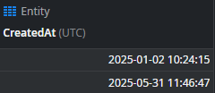
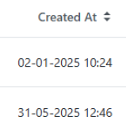

# Troubleshoot date and time shifts caused by daylight saving time

<h2>Troubleshooting</h2>

You may notice that different timestamps are displayed inconsistently in runtime, with some having +1 hour in comparison with the database, whereas other timestamps may be unchanged.
See the example below:

<strong>Database (always UTC)</strong>:

<strong>Runtime</strong>:

Note that the second timestamp has +1 hour in comparison with the data preview from ODC Studio.

This is in fact expected behavior in runtime, as timestamps are automatically adjusted for <a href="https://en.wikipedia.org/wiki/Daylight_saving_time">Daylight Saving Time</a> (DST) periods.
This is part of our public documentation: <a href="https://success.outsystems.com/documentation/outsystems_developer_cloud/onboarding_developers/#time">Time</a>

To eliminate further doubts, it's worth noting that DST adjustments depend on the timestamp being displayed (and whether DST was in effect during that time), not on the current time.
This is why in the above example, only the timestamp from May (DST was in effect) is adjusted by +1 hour.
