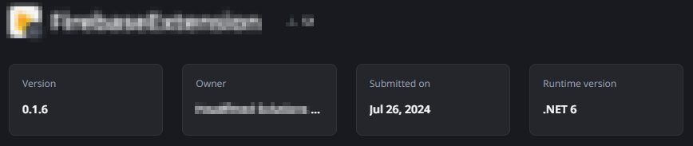

<h1>Error trying to publish an app or installing a Forge component with dependencies on .NET 6</h1>

 
Error Code: OS-ELGW-50022, OS-BLD-50001, OS-DPL-50205, OS-PKGS-50002 
 
<strong>Symptoms</strong>: OS-PKGS-50002, Invalid runtime version 'NET6' for library with key, ODC publish error, OS-ELGW-50022, Unable to publish external library

 

<h2>Troubleshooting</h2>

 

You may run into an error when publishing certain applications or libraries. This Incident Model covers a few different scenarios 
 
<strong>Scenario 1 -&gt; Trying to to install a forge component without success</strong>:

<ul>
<li>The installation of a Forge Component may fail with the error below:
<ul>
<li><code class="editorCode">Sorry, something went wrong. Unable to publish package (library name here) (OS-PKGS-50002)</code></li>
</ul>
</li>
<li>

If it does, check if it is a Library or if it also installing libraries as a dependency; if so, check each of the libraries attempting to be installed, and confirm if their Runtime version is ".NET 6" like the example below:

<ul>
<li>

</li>
</ul>
</li>
<li>

If you can confirm this, proceed to Incident Resolution Measures.

</li>
</ul>

<strong>Scenario 2.1 -&gt; Trying to publish an application without success:</strong>

<ul>
<li>You may also run into the following error when publishing an application in ODC Studio. The error may look like this:
<ul>
<li>

<code class="editorCode">Invalid runtime version 'NET6' for library with key '[library key here]' (OS-ELGW-50022)</code>

</li>
<li>If it does, proceed to Incident Resolution Measures.</li>
</ul>
</li>
<li>It may also simply look like this:
<ul>
<li>

<code class="editorCode">The Build operation failed due to a problem in the producer [library name here]. Please try to republish it before retrying the operation. (OS-BLD-50001)</code>

</li>
<li>

If you get this error, please find the Library in question in ODC Portal, and confirm if their Runtime version is ".NET 6".

<ul>
<li>

If it is, proceed to Incident Resolution Measures.

</li>
</ul>
</li>
<li>

If you can see that the producer is already updated to .NET 8, confirm if your application is already consuming the latest version, and ensure that all of its producers have also been updated as well.

<ul>
<li>

If you are running into these errors and you can confirm that there are no traces of a Library in .Net 6, please contact our <a href="https://success.outsystems.com/Support">Customer Support</a>. 

</li>
</ul>
</li>
</ul>
</li>
</ul>

<h2>Incident resolution measures</h2>

As we explain our article <a href="https://success.outsystems.com/documentation/outsystems_developer_cloud/building_apps/extend_your_apps_with_custom_code/upgrading_custom_code_libraries_to_net_8/">Upgrading custom code libraries to .NET 8</a>, we discontinued the support for .NET 6 as of December, 2024. The main reasons for the upgrade are:

<ul>
    <li>Microsoft is discontinuing .NET 6. <a href="https://learn.microsoft.com/en-us/lifecycle/products/microsoft-net-and-net-core" rel="noopener noreferrer" target="_blank">Learn more</a>.</li>
    <li>Ensuring the latest features, security updates, and support by adopting .NET 8.</li>
</ul>

As such, External Logic Libraries running on .NET 6 can no longer be published at all, and any Library still running in this version is not fully supported, and should be updated to .NET 8 immediately to prevent misbehavior or errors in Runtime.

