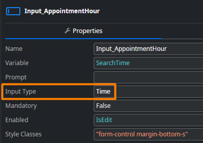
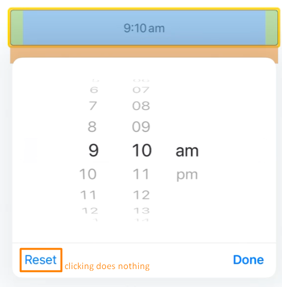
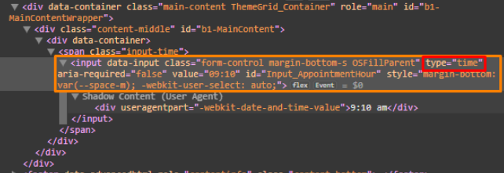
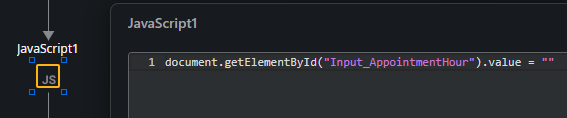

<h1>Time picker in iOS reset button does not work as expected</h1>

This only affects iOS native mobile apps, not PWA or Android.
  
<h2>Confirmation steps</h2>

<ol>
<li>You have an <strong>Input</strong> widget of type <strong>Time:</strong></li>

<li>In iOS, when this input picker is selected, the <strong>Reset</strong> button doesn't clear the selected time - in fact, seems to do nothing at all:

</li>
</ol>
<h3>Context</h3>

In runtime, this widget is nothing more than an [HTML Input element](https://developer.mozilla.org/en-US/docs/Web/HTML/Reference/Elements/input/time") of type time <strong>&lt;input type="time"&gt;</strong>

Each browser or native UI will treat this input differently for <strong>iOS 18</strong>, this is the observed behavior:
<ol>
<li>Input starts out empty</li>
<li>As soon as it's opened, it auto-fills with the current time</li>
<li>From this point onward, the <strong>Reset</strong> button will only reset the time to the previously selected value <u>in the time picker</u>, but it doesn't change the selected value of the input itself, and will also not reset it back to empty.</li>
</ol>

For <strong>iOS 26</strong>, this is the observed behavior (partially fixed from <strong>iOS 18</strong>):
<ol id="isPasted">
<li>Input starts out empty</li>
<li>As soon as it's opened, it auto-fills with the current time</li>
<li>If the picker is opened again and a new time is selected, clicking <strong>Reset</strong> does reset to the previous value. This works once</li>
<li id="isPasted">From this point onward, if the picker is opened again, the <strong>Reset</strong> button will only reset the time to the previously selected value in the time picker, but it doesn't change the selected value of the input itself, and will also not reset it back to empty.</li>
</ol>

<h4>Workaround</h4>

Since this is how iOS natively handles time pickers, we can't directly change the behavior of the native inputs.

However, we can add a custom <strong>Reset</strong> button outside the time picker which does, for example, reset the time picker back to empty, using Javascript:

`document.getElementById("Input_AppointmentHour").value = ""`
