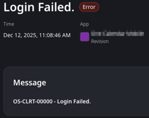

# Login failed when logging into an app using iOS devices

This error is exclusive to native mobile apps running on an iOS device. It is also exclusive to the built-in Identity Provider.

## Troubleshooting

When logging into a native mobile application using an iOS device, you may encounter an error message that states "OS-CLRT-00000 - Login failed", as shown in the following screenshot:

If you encounter this error and can confirm it only occurs with iOS devices, open your [Content Security Policy](https://success.outsystems.com/documentation/outsystems_developer_cloud/security_of_outsystems_developer_cloud/content_security_policy/). In the **connect-src** directive, confirm you have the following entries:

* https://*.amazonaws.com
* https://[built-in-runtime-domain].outsystems.app/identity

Here's what they look like as an example:

![Screenshot of the Content Security Policy configuration showing the 'connect-src' directive with entries for 'https://*.amazonaws.com' and 'https://[built-in-runtime-domain].outsystems.app/identity'.](images/im-image-ck-6121fab1-657d-4474-859d-8affc5585a11.png "Content Security Policy Configuration")

From here, proceed as described:

* If you **don't** have the entries above, or if you have them **without https://** (for example, "*.amazonaws.com" and "[built-in-runtime-domain].outsystems.app/identity"), proceed to **Incident Resolution Measures**.
* If the entries **with https://** are present, confirm if the error is occurring for that specific stage. If the error persists with https://, [contact our Global Support Team](https://success.outsystems.com/support/home/) and mention that you followed the steps described in this article.

## Incident Resolution Measures

The error above occurs because of a behavior that is specific to iOS, which conflicts with Content Security Policy.

In iOS, mobile apps load content using the protocol "outsystems://", not "https://". As such, if the connect-src directives described above don't explicitly add the protocol (for example, using "*.amazonaws.com" instead of "https://*.amazonaws.com"), CSP runs the check using the protocol of the request, which would be "outsystems://*.amazonaws.com", causing it to fail.

To resolve this issue, add https:// to the beginning of each entry. For each runtime stage, the entries should look like this:

* https://*.amazonaws.com
* https://[built-in-runtime-domain].outsystems.app/identity