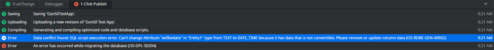
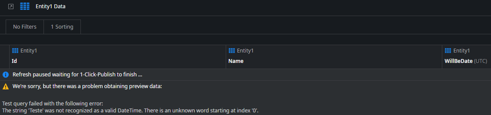

---
summary:
locale: en-us
guid: ee22489c-59f4-456f-8c2c-22eadab72e4a
app_type: mobile apps, reactive web apps
platform-version: odc
figma:
isautopublish: true
---

<h1>Unable to publish due to not convertible Attribute data</h1>

 
Error Code: OS-RDBE-GEN-40902, OS-DPL-50204 
 
<strong>Symptoms</strong>: OS-RDBE-GEN-40902, OS-DPL-50204, Can't change attribute type because it has not convertible data, 1CP error

 

<h2>Troubleshooting</h2>

 

When publishing an application, you may run into an error like the one in this screenshot:

<code class="editorCode">Can't change Attribute "[attribute_name]" in "[entity_name]" type from [old_data_type] to [new_data_type] because it has data that is not convertible. Please remove or update column data (OS-RDBE-GEN-40902)</code>

 

If you receive this error, the next step is to confirm that it is being returned correctly. As it indicates, the data type of an attribute has changed, and it has data that isn't convertible to this new type. If you want to confirm the exact circumstances of the error, you can open the application in ODC Studio and click on the entity to preview its data. You may see something like this:

 

The warning above even specifically states what Data is not convertible; as we can see, the "WillBeDate" attribute has a record with the value "Teste", which cannot be converted to Date Time. If the warning you see makes similar sense in your case, proceed to Incident Resolution Measures.

 

<h2>Incident Resolution Measures</h2>

 

This error can be a completely expected occurrence, because it is preventing a publish operation from going through that would cause data to essentially be invalid given the new data type. As seen in the example above, an attribute of type "Text" that has "Teste" as the value in one of its records is being changed to "Date Time".

If you believe the error is expected in your case, then you mainly have two options ahead:

<ul>
    <li>Reverting the Data Type change;</li>
    <li>Clearing the Data that is conflicting with the new Data type.</li>
</ul>

If instead you believe the error is unexpected in your case, such as the data not being incompatible, or no data type change actually occurring, please contact our <a href="https://success.outsystems.com/support/home/">Global Support Team</a>.

