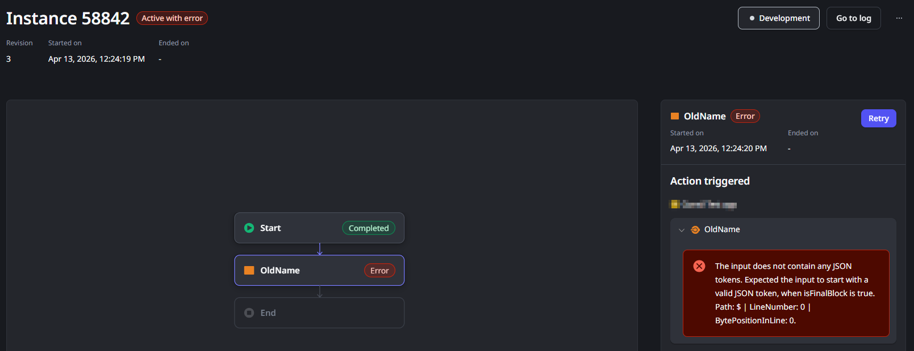
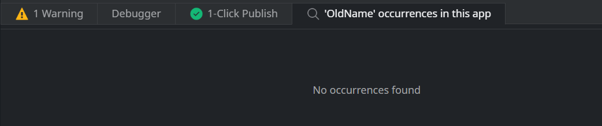
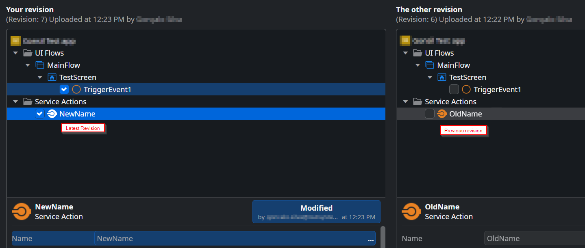

# Workflow fails with a missing JSON tokens error

ODC workflows fail at runtime with a JSON tokens error when a Service Action they depend on is renamed, deleted, or significantly changed in its producer app. The workflow loses its reference to the original Service Action and can't deserialize the response. Republishing the workflow resolves most cases; if the Service Action was deleted, the workflow itself must be updated.

## Troubleshooting

A workflow fails in a specific logic node, such as an automatic activity, with the following error:



```
The input does not contain any JSON tokens. Expected the input to start with a valid JSON token, when isFinalBlock is true. Path: $ | LineNumber: 0 | BytePositionInLine: 0.
```

The logic node triggers a Service Action named OldName. If you open the producer app, you won't find a Service Action with that name.



To confirm the cause, compare the producer app with older versions. Look for the last version before the error started and check for a Service Action that changed. The following screenshot shows an example where the Service Action was renamed:



## Incident Resolution Measures

This error occurs because renaming, deleting, or otherwise changing a Service Action breaks consumer workflows that depend on it. For more information, refer to [Immediate and impactful changes](https://success.outsystems.com/documentation/outsystems_developer_cloud/building_apps/handle_changes_in_exposed_functionality/#immediate-and-impactful-changes).

To resolve the error:

* If the Service Action was **renamed**: republish the affected workflow with no other changes required.
* If the Service Action was **deleted or significantly changed**: update the workflow to remove or replace the reference to the old Service Action, then republish.
