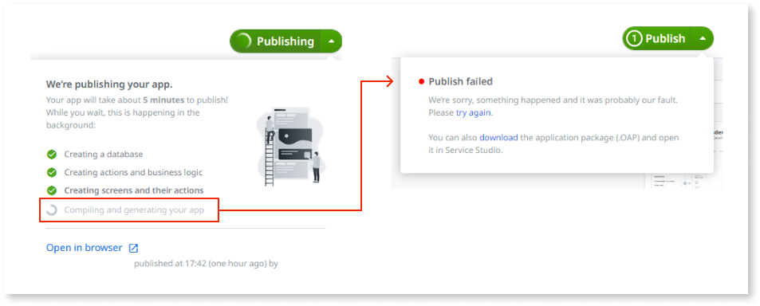

---
tags:
summary: Learn how to fix potential problems with connectivity when using Experience Builder.
locale: en-us
guid: 765eb14f-607d-4084-9160-6d834e480720
app_type: traditional web apps, mobile apps, reactive web apps
platform-version: o11
figma: https://www.figma.com/file/6tXLupLiqfG9FOElATTGQU/Troubleshooting?type=design&node-id=3417%3A29&mode=design&t=9gkUWeliEMv62WuL-1
---

# Connectivity in Experience Builder

## Problem

Connection issues manifest in various scenarios and use cases, such as:

* Registering the infrastructure for the first time.

* Logging into Experience Builder.

* Publishing the app through Experience Builder. Ensure to reach the final step, **Compiling and generating your app**.

    

## Solution

* Ensure that there isn't anything blocking communications, for example, internal networks or Firewalls, between Experience Builder and Lifetime/Development Environments.

* Confirm that you allow communications as stated in [OutSystems network requirements](https://success.outsystems.com/documentation/11/setup_and_maintain_your_outsystems_infrastructure/setting_up_outsystems/outsystems_network_requirements/) under the **Experience Builder** section.

* Ensure that internal network configurations allow inbound traffic according to the network requirements.
