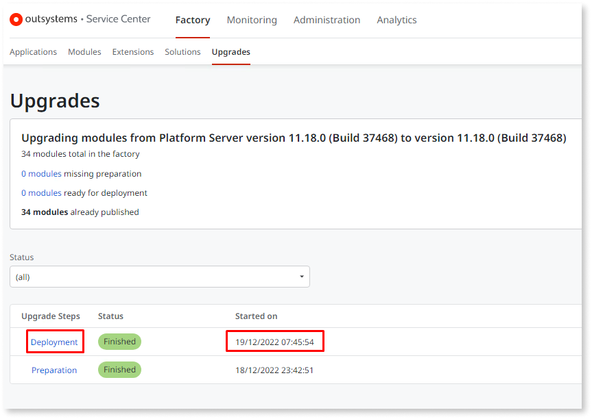
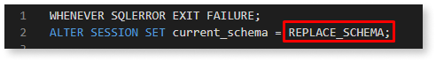

# Multiple new tenants after using Deploy All - RPM-3448

This article applies to on-premises environments.

This article's guides you on:

* Checking if your on-premises environments are affected by the RPM-3448 known issue introduced in Platform Server 11.18.0. This known issue is described in detail in the [release notes](https://success.outsystems.com/Support/Release_Notes/11/Platform_Server#known_issues_fixing_platform_server_11.18.0).

* Fixing the issue in affected on-premises environments.

## Symptoms

### Confirm that you're affected { #check-affected }

The known issue is triggered after using the new [Deploy All](https://success.outsystems.com/Documentation/11/Setup_and_maintain_your_OutSystems_infrastructure/Upgrade_OutSystems_platform/Modules_deployment_step_during_Platform_Server_upgrade) feature introduced with Platform Server 11.18.0.

As such, the easiest way to confirm if your environments are affected by RPM-3448  is to check if this feature was used. Do the following:

1. Log in into the Service Center of each environment you want to check.

1. Access the **Upgrades** page found under the **Factory** menu.

1. Check which **Upgrade Steps** were performed:

    * If the **Deployment** step was executed, it will be logged in this screen. If the Deployment step is shown, the environment **is affected**, even if the step's status is **Error**.

        

    * Otherwise, if nothing appears or it just shows that the **Preparation** step was performed, the environment **isn't affected**.

## Resolution

If **Deploy All** was used and you are affected, a Tenant was created for every Module in the environment. Alongside this Tenant, multiple Timers and Site Properties were duplicated for each Tenant. As such, to address the situation, the invalid Tenants need to be cleaned up.

The options available to resolve this situation are:

* In case you have created a backup of both the Front-End(s) and the Database servers, you can perform a rollback to a point in time before the update to Platform Server 11.18.0. Be aware that any changes made after that point in time will be lost.

* If the rollback is not an option, follow the [cleanup procedure](#cleanup-procedure).

### Cleanup procedure

The cleanup procedure is comprised of the following high-level steps:

1. Create a database backup.

1. Download the cleanup scripts.

1. Execute the cleanup scripts.

1. Final validation.

Before executing the procedure, we highly recommend reading each step carefully and, if any questions arise, reach out to us first via [Support Ticket](../../community/open-support-case.md).

The cleanup procedure depends on the platform database used in your environments, so choose the correct procedure depending on your setup.

#### Cleanup for Microsoft SQL Server

1. **Create a database backup**.  
    Before executing the scripts, the first and most important step is to create a database backup to ensure that if anything goes wrong you can roll back to a point in time before the script execution.

1. **Download the cleanup scripts**, by doing the following:

    1. Download the [cleanup scripts for Microsoft SQL Server](resources/MSSQL_cleanup_scripts.zip) and unpack them.

1. **Execute the cleanup scripts**, by doing the following:

    1. Connect to the Database server using your preferred SQL client. We recommend SQL Server Management Studio which was the one we used in our tests.

    1. Open and execute the **MSSQL_1_create_cleanup_comands.sql** script. This script identifies the invalid Tenants created after clicking the Deploy All button and creates the SQL commands for the cleanup.

        

        * If the script outputs the text '**The Deploy button was not clicked. Please confirm this in Service Center &gt; Factory &gt; Upgrades.**', the environment shouldn't be affected by the known issue. [Double-check if the environment is affected](#check-affected).

        * If the script outputs the text '**Skipped Tenant with ID [X] (...)**', please evaluate if that Tenant is, in fact, a valid one.

        

    1. Open and execute the **MSSQL_2_execute_cleanup.sql** script.

1. **Do the final validation** by following these steps:

    1. Open and execute the **MSSQL_3_sanity_check.sql** script.

    1. Depending on the output of the script, do one of the following:

        * If the script outputs **Tenant cleanup was successful**, drop the temporary tables by executing the **MSSQL_4_delete_temp_tables.sql** script.

        * If the script outputs **Tenant cleanup failed**, please perform a rollback. Then, open a [support ticket](../../community/open-support-case.md) and send us the full content of the **temp_command** table.

#### Cleanup for Oracle

1. **Create a database backup**. 
    Before executing the scripts, the first and most important step is to create a database backup to ensure that if anything goes wrong you can roll back to a point in time before the script execution.

1. **Download and customize the cleanup scripts**, by doing the following:

    1. Download the [cleanup scripts for Oracle](resources/ORACLE_cleanup_scripts.zip) and unpack them.

    1. Open each of the four SQL scripts you download in the previous step, and in the first lines, replace the **REPLACE_SCHEMA** placeholder with the correct OutSystems Platform schema.

        

        The default Platform schema is **OSADMIN**.
        To check the Platform schema in use for the environment, open the **Configuration Tool** and check the **Platform** tab.

        

        

    1. Save the changes in each of the SQL scripts.

1. **Execute the cleanup scripts**, by doing the following:

    1. Connect to the Database server using your preferred SQL client. We recommend Oracle SQL Developer which was the one we used in our tests.

    1. Open and execute the edited  **Oracle_1_create_cleanup_comands.sql** script. This script identifies the invalid Tenants created after clicking the Deploy All button and creates the SQL commands for the cleanup.

        

        * If the script outputs the text '**The Deploy button was not clicked. Please confirm this in Service Center &gt; Factory &gt; Upgrades.**', the environment shouldn't be affected by the known issue. [Double-check if the environment is affected](#check-affected).

        * If the script outputs the text '**Skipped Tenant with ID [X] (...)**', please evaluate if that Tenant is, in fact, a valid one.

        

    1. Open and execute the edited **Oracle_2_execute_cleanup.sql** script.

1. **Do the final validation** by following these steps:

    1. Open and execute the **Oracle_3_sanity_check.sql** script.

    1. Depending on the output of the script, do one of the following:

        * If the script outputs **Tenant cleanup was successful**, drop the temporary tables by executing the **Oracle_4_delete_temp_tables.sql** script.

        * If the script outputs **Tenant cleanup failed**, please perform a rollback. Then, open a [support ticket](../../community/open-support-case.md) and send us the full content of the **temp_command** table.
