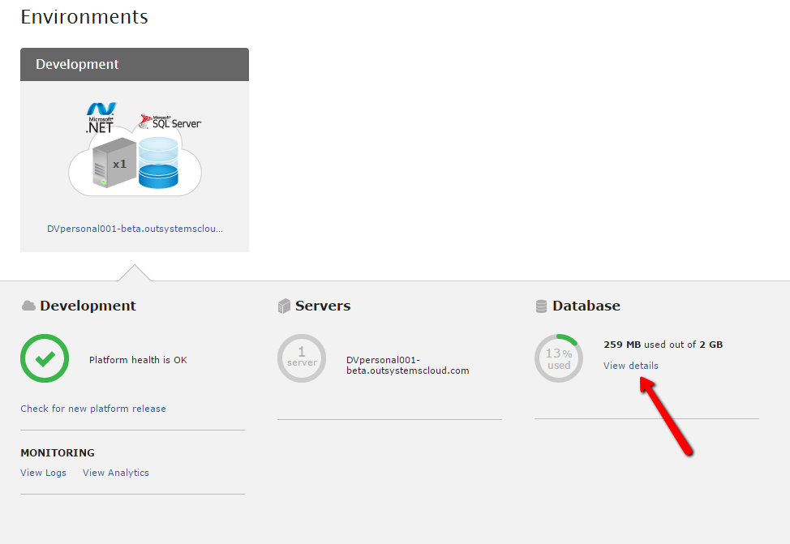
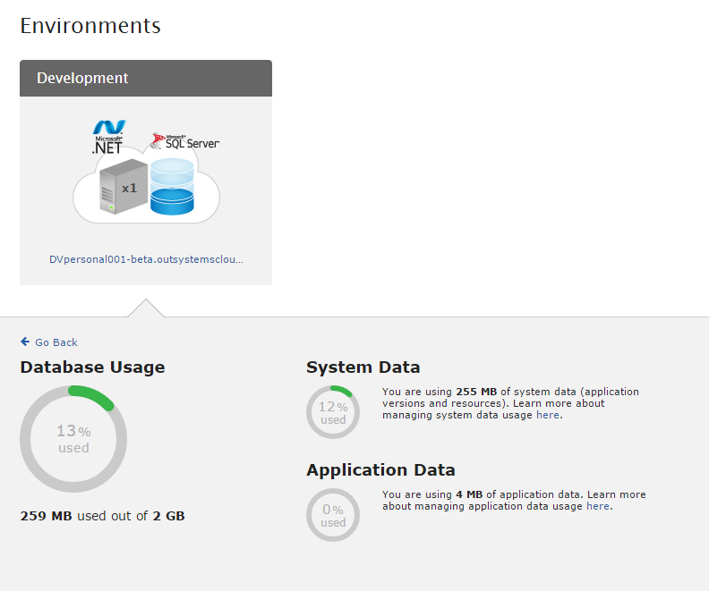

# Manage the database space of your personal environment

If you are [reaching the storage database limit](#check-how-much-database-space-you-have) of your Personal Environment, see [Best practices for a tidy and clean environment](https://success.outsystems.com/Documentation/Best_Practices/Lifecycle/Best_practices_for_a_tidy_and_clean_environment) to learn how to clear database space. 

Personal Environments have a database limit of 2GB. The database stores the following: 

* **System data**: The metadata used by the OutSystems Platform. This includes, for example, the apps definition, data model, module configurations, logs, and app versions. The system data usually increases as you develop and deploy your app.

* **Application data**: The data your apps generate and manipulate. The application data usually increases as your users access your apps.

## Check how much database space you have

1. Go to your Personal Environment at `https://<yourpersonal>.outsystemscloud.com`.

2. Click **Environments** tab.

In this example only 13% of the available database storage space is being used.

To check how much space is being used for system data and application data, click the **View details** link.

Note that these metrics are updated every hour, so they might not represent the actual space you're using at the moment.

If the personal environment becomes unavailable or the space used reaches 100% on LifeTime Environment Health, by reaching the 2GB allocated to the environments, it will be necessary to open a Support Case with OutSystems to unblock the environment and suggest specific cleanup actions according to each use case.

