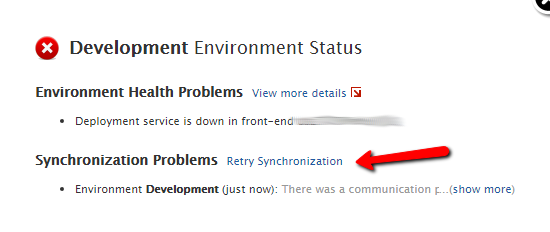

# Restart services on OutSystems Cloud

## Overview 

Should any issues with OutSystems services arise on a cloud environment, you can check the related errors and:

* Retry synchronization to see if it's just a communication issue.
* Restart the OutSystems services in case they got stuck.

This option isn't available in Personal Environments.

## Resolution 

On 1 you can check the detail of the error and on 2 you can have some more details about that environment:

On the error report, you can try to sync your environment again just to see if this was just a communication problem. If it doesn't resolve the issue, then you can go to the environment details and restart OutSystems services:

Clicking **Restart Services** performs an IIS reset, clears the application pools, and Restart all OutSystems Services (OutSystems Deployment Controller Service, OutSystems Deployment Service, OutSystems Scheduler Service) and clears any hanging requests. In the case of multiple front-ends, this restart is balanced (front-end servers are restarted one at a time). 

