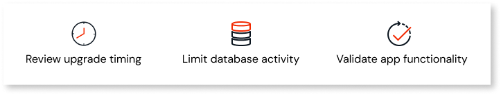

# SQL Server 2022 upgrade in O11 Cloud

OutSystems will upgrade all O11 Cloud SQL Server databases from version 2016 to 2022 between June and September 2025. This upgrade ensures continued Microsoft support until January 2033 and reinforces OutSystems' commitment to delivering a future-ready, reliable, and compliant platform.

No customer action is required. The upgrade is designed to complete without downtime for your environments.

You'll receive an email notification with your specific upgrade schedule as part of OutSystems Cloud maintenance communications.

## FAQs

### Why is OutSystems upgrading SQL Server to version 2022 in O11 Cloud?

Microsoft's extended support for [SQL Server 2016](https://learn.microsoft.com/en-us/lifecycle/products/sql-server-2016) ends in July 2026\. Upgrading to [SQL Server 2022](https://learn.microsoft.com/en-us/lifecycle/products/sql-server-2022) ensures long-term support until January 2033, keeping your environments secure, stable, and compliant.

### Will the upgrade require downtime?

No. The implemented solution allows the upgrade to complete without service interruption to our customers.

The upgrade window is scheduled for 8 hours, but in most cases, the operation will complete much faster.  

### What do I need to do?

OutSystems fully manages the upgrade process. Here's what we recommend:

* Review your upgrade schedule when you receive the email notification.  
* Avoid heavy database operations during the scheduled window to ensure smooth completion.  
* Run your regular app tests after the upgrade to ensure everything works as expected.

### What new features will be available?

You'll benefit from an updated technology stack with no impact on your experience. Your queries will continue working just as before. We are also updating the compatibility level of the database from 130 to 150. This means you can take full advantage of new features introduced in [SQL Server 2017](https://learn.microsoft.com/en-us/sql/sql-server/what-s-new-in-sql-server-2017?view=sql-server-ver17) and [SQL Server 2019](https://learn.microsoft.com/en-us/sql/sql-server/what-s-new-in-sql-server-2019?view=sql-server-ver15).

### Are there any breaking changes?

No. This upgrade will improve the reliability and future readiness of OutSystems Cloud. We'll ensure that the upgrade is transparent so that you can continue to use your environments without needing to adapt your code or configurations. 

### When will the upgrade occur?

The upgrade schedule is planned as follows:

* Rollout phase: June to September 2025  
* Operations take place during your defined maintenance window (extended to 8 hours for this operation)  
* You'll receive an operation notification via email describing:  
  * Affected environments  
  * Exact UTC time of the operation

To receive notifications, make sure your infrastructure admins are registered in the [Customer Portal](../../community/customer-portal.md).

### Can I reschedule my upgrade?

Yes. To reschedule your upgrade, submit a support case through the [Support Portal](https://success.outsystems.com/support/home/). A support agent will assist you with the rescheduling.

### What's the deadline for completing the upgrade?

All upgrades must be completed by September 30, 2025.

### Can I opt out of this upgrade?

No. This upgrade is mandatory for all O11 Cloud environments.

### Who can I contact for further questions?

If you have any questions, contact your customer success manager. If you don't have one, contact us via our [support channels](https://www.outsystems.com/legal/success/support-terms-and-service-level-agreements-sla-of-the-outsystems-software/#contact-channels).