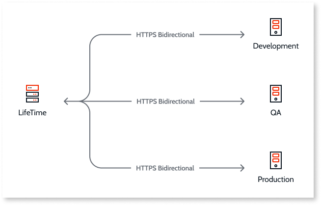

# Test the connectivity between OutSystems environments

In OutSystems architecture, you need to have bidirectional communication between the LifeTime environment and all the application environments.

## Test the connectivity

If you need to test the connectivity between two specific environments, do the following:

1. Connect to the server of the first environment through a remote desktop tool.

2. From that server, open a browser and try to access the Service Center console of the second environment (`https://<environment_server>/ServiceCenter`). If the Service Center’s page is displayed correctly, the connection is ok.

For further information about the connectivity between environments, check the [Network infrastructure requirements](https://success.outsystems.com/Documentation/11/Setting_Up_OutSystems/OutSystems_network_requirements#Network_infrastructure_requirements).
