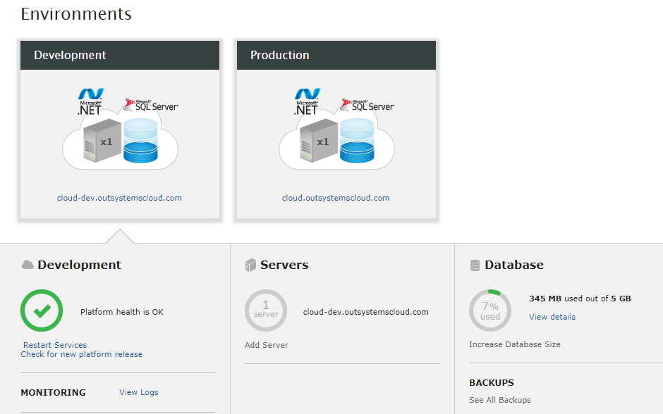
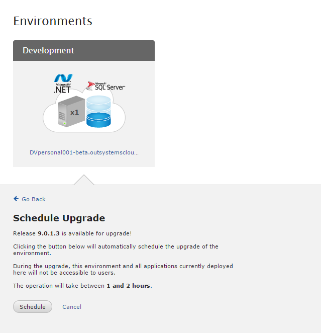
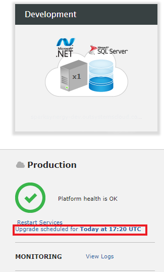
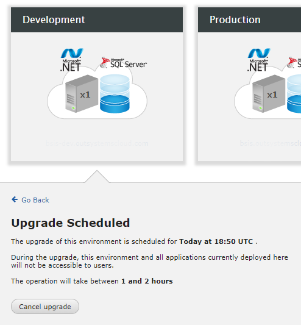

# Upgrading your Cloud demo

Cloud demos are OutSystems Cloud infraestructures provided to our partners for non-production purposes.

Before you start, make sure to check the [general upgrade guidelines before proceeding](https://success.outsystems.com/Support/Enterprise_Customers/Upgrading/01_Upgrade_OutSystems_Platform). This will help you understand what's involved and what you should plan in advance.

Upgrading an OutSystems Cloud demo environment will result in downtime for that environment and its applications.

There are two ways to choose how to upgrade your OutSystems Cloud demo environment: self-service upgrade and automatic upgrade.

## Self-service upgrade

You can schedule the upgrade of each of your environments on your own once you receive a communication from OutSystems regarding a new platform version. Usually, we provide a one-week window for self-service upgrades. To schedule an upgrade to the latest available version follow these steps:

1. Access your Cloud demo LifeTime console, and navigate to the Environments tab.

    

1. You’ll find a link to **Check for a new platform release**. If a new release is available you’ll be able to schedule the upgrade. The upgrade will be scheduled automatically to an available time slot.

    

1. After the upgrade of the Development environment has finished, proceed to upgrade your Production environment.

## Cancel a scheduled upgrade

After scheduling the upgrade of an environment, you can cancel this schedule by following the below steps:

1. Select the environment that will be upgraded, in the Environments tab of LifeTime.
1. Click on **Upgrade scheduled for**.

    

1. In the next screen, you'll be able to cancel the scheduled upgrade.

    

## Automatic upgrade

For any environments not upgraded during the self-service upgrade period, OutSystems will perform the upgrade within two weeks of the end of the self-service upgrade period.

## Frequently asked questions

* **How long will I remain on the current version?**

    You'll remain on the same version of OutSystems until a new version is released. Upon the release of a new version, you can request to postpone the upgrade of your environments for up to 1 (one) week after the expiration of the self-service upgrade period.

* **Will the upgrade cause downtime for my environments?**

    Yes, your environment won't be accessible during the upgrade. The upgrade process usually takes between 1 to 4 hours.

* **Can I request the upgrade before the self-service upgrade period?**

    No, it isn't possible to request an upgrade before the self-service upgrade period.
