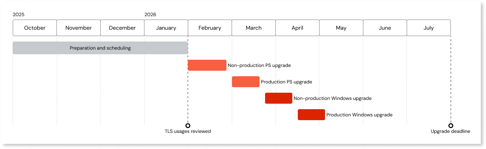

# Windows Server 2022 upgrade in O11 Cloud

OutSystems will upgrade all Windows Server 2016 environments in OutSystems 11 Cloud to Windows Server 2022. This mandatory upgrade ensures your environments remain secure, reliable, and supported for years to come.

[Microsoft will end support for Windows Server 2016 in January 2027](https://learn.microsoft.com/en-us/lifecycle/products/windows-server-2016). By moving to Windows Server 2022, OutSystems aligns its infrastructure with Microsoft's current lifecycle, ensuring continued support. This upgrade also strengthens the security and performance foundations of your environments, helping protect your applications and data against evolving threats.

As part of this change, OutSystems will also:

* Upgrade environments to Platform Server (PS) version 11.40.0 and LifeTime 11.28.0, ensuring compatibility with Windows Server 2022 and access to the latest stability, security improvements, and platform unification features.  
* Enable TLS 1.3 and disable TLS 1.0 and 1.1, aligning with modern security standards.

To minimize disruption, OutSystems will roll out this upgrade in phases throughout the first half of 2026. Customers will receive advance notice and a confirmed schedule well ahead of the operation. There will also be flexibility to adjust planned dates if needed, ensuring you have time to prepare and align with your internal release or freeze periods.  
This page provides all the details you need to understand the impact of this change, what to expect, and how to prepare.

Start preparing now. Most preparation tasks do not depend on your specific schedule and can be completed in advance. While Platform Server 11.40.0 has not been released yet, you can begin reviewing breaking changes up to the latest available Platform Server version to identify potential impacts on your applications.

## Timeline and rollout plan

The Windows Server 2022 upgrade will be rolled out in phases throughout the first half of 2026, ensuring a smooth and predictable transition for all customers. Each environment will have a dedicated upgrade schedule, communicated well in advance.

### Key milestones

* **Preparation and scheduling (October 2025 – January 2026)**: OutSystems will send the initial communication announcing the upgrade and its timeline. During this phase, customers will receive their confirmed schedule for the two required operations — the Platform Server upgrade and the Windows Server upgrade. This extended notice period is designed to give you enough time to prepare and align the upgrade with their own release cycles or freeze periods. During this period, customers are expected to review their environments for potential breaking changes, including validating TLS usage, so any required adjustments are completed before the upgrade operations begin.  
* **Upgrade operations (starting early 2026):** We'll begin executing the upgrade in phases across all OutSystems 11 Cloud environments.
* **Upgrade completion (by July 31, 2026)** All OutSystems 11 Cloud environments must be upgraded to Windows Server 2022 by this date.

We understand that infrastructure changes need to align with internal release calendars and freeze periods. If your assigned date isn’t suitable, you can request a schedule change through OutSystems Support. Rescheduling requests will be evaluated case by case, and OutSystems will work with you to find an alternative date within the upgrade window.

The timeline below is an example of a typical upgrade sequence. Exact dates and durations will vary depending on your scheduled upgrade.

### Maintenance windows and downtime

The upgrade will be performed during the [maintenance window](../../enterprise/maintenance/cloud-maintenance-window.md) configured for your infrastructure.

* Environments with multiple front ends: upgrades are performed one server at a time, minimizing downtime.  
* Environments with a single front end: downtime is expected while the server is replaced. A reminder notification will be sent 48 hours before each operation begins.

## Prepare for the upgrade by adapting apps to breaking changes

While the upgrade to Windows Server 2022 has been designed to minimize disruption, there are several technical areas that may require customer action. Customers should review these areas during the Preparation and scheduling phase and make any necessary adjustments before their upgrade date.

### Preparation checklist

Work through this checklist as soon as possible. The actions in this section can be completed before your dates are assigned and should be finished during the preparation and scheduling phase. Waiting increases the risk of disruption.

* Review your scheduled upgrade dates and plan any necessary internal alignment, including coordinating with release calendars or freeze periods.  
* [Review and prepare for TLS protocol deprecation](#tls-protocol-deprecation).  
* [Check for operating system dependencies that may require updates.](#operating-system-dependencies)  
* [Plan any changes needed due to private IP address updates.](#private-ip-address-changes)  
* [Address front end storage usage to prevent data loss.](#front-end-storage-usage)  
* [Review and adapt your applications to Platform Server breaking changes.](#platform-server-upgrade-impacts)  
* Validate your apps before the production upgrade takes place.

### TLS protocol deprecation {#tls-protocol-deprecation}

As part of this upgrade, TLS 1.0 and 1.1 will be permanently disabled, and TLS 1.3 will be enabled by default. TLS 1.2 remains supported. TLS 1.0  and TLS 1.1 are outdated and insecure protocols, with well-documented cryptographic weaknesses. Disabling them is an industry standard and required for most modern compliance frameworks.

#### Impact

The upgrade impacts both inbound and outbound traffic. Any system communicating with OutSystems must use TLS 1.2 or higher.
Before this upgrade, outbound traffic from OutSystems applications only allowed TLS 1.2 by default. In some setups, Extensions may have been used to override this behavior and force TLS 1.0 or 1.1. After the upgrade, this customization will no longer be possible.

Any inbound or outbound traffic using TLS 1.0 or 1.1 will fail after the upgrade. This includes connections from external systems to OutSystems Cloud and outbound calls from OutSystems apps.

#### Actions required

* Review all inbound integrations to ensure they support TLS 1.2 or higher.

* For outbound traffic, check for the use of any Extensions that modify TLS behavior and remove or update them as needed. Forge components like [HTTPS Consumer](https://www.outsystems.com/forge/component-overview/3591/https-consumer-o11) and [Set Security Protocol](https://www.outsystems.com/forge/component-overview/3994/set-security-protocol-o11)  are common examples of extensions that may be used to force older TLS versions, but other custom solutions may exist.

### Operating system dependencies {#operating-system-dependencies}

Custom extensions built for Windows Server 2016 may not behave as expected on Windows Server 2022.

#### Impact

1. Operating system level dependencies may break due to API or library differences between Windows Server 2016 and 2022.  
1. .NET behavior changes may impact some extensions.

#### Actions required

* Review your custom extensions for explicit dependencies on Windows Server 2016 or configurations that are incompatible with Windows Server 2022.

### Private IP address changes {#private-ip-address-changes}

When your front-end servers are replaced with Windows Server 2022, they will receive new private IP addresses. Public IP addresses will not change.  
If you’re connecting to your OutSystems Cloud environment over a VPN, these private IP addresses are typically what your external systems use to reach OutSystems Cloud. OutSystems allocates these private IP addresses from a defined IP range that’s specific to your infrastructure. These IPs are not static, meaning they can change when front-end servers are recreated, as happens during this upgrade.

#### Impact

* For private IPs:  
    * If your firewall or VPN configuration is allowlisting individual private IPs, these rules may no longer work after the upgrade.  
    * If you’ve followed the recommended best practice of allowlisting the entire IP range, no action is needed, the new private IPs will remain within that range.  
* For public IPs: This change does not affect public IP addresses, so any external integrations that rely on public IPs remain unaffected.

#### Actions required

Do one of the following:

* Best practice: [allowlist the full IP range](https://www.outsystems.com/tk/redirect?g=4b1ae768-0a96-45b1-8eb5-b5590ac28274) of your OutSystems Cloud on your firewall to avoid future disruptions.  
* If you currently allowlist individual IPs, update your rules after the upgrade to reflect the new private IPs, or preferably, switch to IP range allowlisting.

### Front end storage usage {#front-end-storage-usage}

Data stored on a front-end server’s local disk will not persist after the upgrade.

#### Impact

Temporary files saved to the local disk will be lost.

#### Actions required

1. Audit your applications for front end storage usage on the `D:\User` folder.  
1. Move temporary or persistent data to other storage solutions if it can’t be lost.  
1. Ensure no critical data depends on local file paths on front-end servers.

### Platform Server upgrade impacts {#platform-server-upgrade-impacts}

Upgrading the Platform Server to version 11.40.0 is required before the Windows Server upgrade. This step may introduce breaking changes depending on your current version.

#### Impact

Depending on your starting version, this may introduce breaking changes to platform or runtime behavior.

#### Actions required

1. Review the [OutSystems 11 side effects and breaking changes](../../release-articles/11/side-effects-breaking-changes.md) for the versions you're moving across. Since Platform Server 11.40.0 has not been released yet, you can begin preparing by reviewing breaking changes up to the latest available version to identify potential impacts on your applications.  
1. Adapt applications and extensions where needed ahead of the upgrade.

## FAQ

**Can I opt out of the upgrade?**  
No. The Windows Server 2022 upgrade is mandatory for all OutSystems 11 Cloud environments.

**What is the deadline to complete the upgrade?**  
All OutSystems 11 Cloud environments must be upgraded by July 31, 2026. You can request a schedule change to better align with your internal release cycles or freeze periods.

**When can I start preparing and handling breaking changes?**

Right away. Most preparation steps don’t depend on your scheduled dates and can be completed in advance. Starting early gives you more time to adapt your applications and reduces the risk of disruption during the upgrade.

**What if I need to upgrade after the deadline?**

Exception requests must be submitted as a support case with clear business justification. OutSystems support and your account team will assess these on a case-by-case basis.

**How can I request a schedule change?**

Submit a request through the support portal. A support agent will review and process the request.

**What if I can't disable older TLS versions?**

In rare cases where it isn’t possible to disable older TLS versions on dependent systems, OutSystems will work with you to assess the situation. Contact your account team or Support to discuss options. These cases are exceptional, and the expectation remains to upgrade to TLS 1.2 or higher.

**Can I upgrade Windows without upgrading the Platform Server?**

No. The Platform Server upgrade to version 11.40.0 is required to ensure compatibility with Windows Server 2022 and to benefit from the latest stability and security improvements.

**How will I be notified about the upgrade?**

* **Advance notice email:** Sent in October 2025, with high-level information and this supporting documentation.  

* **Scheduling notifications:** Sent to infrastructure admins in [customer portal](../../community/customer-portal.md):  

    * Initial notification with the scheduled dates and affected environments.  
    * Reminder 48 hours before the operation starts.  
    * Notification at the start of the operation.  
    * Notification at the end of the operation.

* All scheduled operations can also be consulted at the **Cloud operations** tab in support portal.

**Who can I contact for further questions?**

You can contact your account team or submit a case through the support portal.
