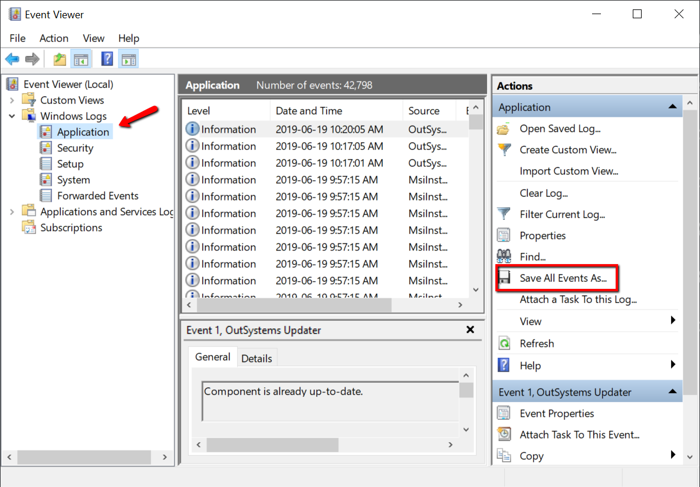

# Windows Event Viewer logs

To get the Windows event logs for a specific environment, follow these steps:

1. Connect to the server using Remote Desktop.

1. Launch the Windows Event Viewer application.

1. Expand the **Windows Logs** folder.

1. Select the logs category, such as **Application**, **Security**, or **System**.

1. Click **Save All Events As…** on the right panel to save the file.

    

