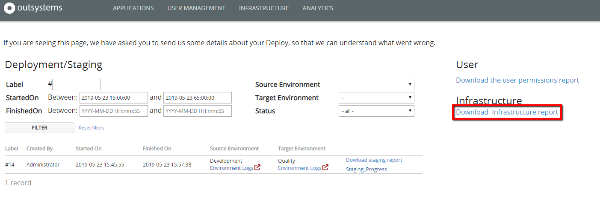
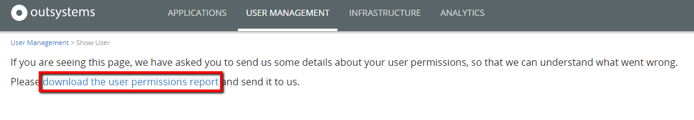

# LifeTime reports

You need [Manage Infrastructure and Users](https://success.outsystems.com/Documentation/11/Managing_the_Applications_Lifecycle/Manage_IT_Teams/About_Permission_Levels) permission to get these reports. If you don’t have this permission, contact your infrastructure manager.

## LifeTime Report { #lifetime-report }
To get the Lifetime report, follow these steps:

### Get LifeTime report in OutSystems 11

1. Access the page `https://<LifeTime_server>/lifetime/troubleshoot.aspx`

1. Click the link **Download Infrastructure report** to save the file.

    

If you are getting this report by request of OutSystems Support, fetch the file you saved from the local download folder and **attach it to your support case**.

### Get LifeTime report in OutSystems 10

1. Go to the LifeTime console, `https://<LifeTime_server>/lifetime`

1. Click the **Send us your feedback** icon at the upper right corner.

    

1. Click the **here** link to save the file.

    

If you are getting this report by request of OutSystems Support, fetch the file you saved from the local download folder and **attach it to your support case**.

## Staging Report
To get the staging report, follow these steps:

### Get the staging report in OutSystems 11

1. Access the page `https://<LifeTime_server>/lifetime/troubleshoot.aspx` to see the **Deployment/Staging** list.

1. In the Stagings list, identify the staging you need to troubleshoot. You can filter by the staging date or environments.

1. In the row of the identified staging, click the link **Download staging report** to save the file.

    

If you are getting this report by request of OutSystems Support, fetch the file you saved from the local download folder and **attach it to your support case**.

### Get the staging report in OutSystems 10

1. Go to the LifeTime console, `https://<LifeTime_server>/lifetime`

1. In the **Applications** page, click the name of the target environment and choose **View Change Log** from the drop-down menu.

    

1. Take note of the deployment plan number for the deployment you want to troubleshoot.

    

1. Using that deployment plan number, access the following page:
 `https://<LifeTime_server>/lifetime/DebugStaging.aspx?StagingId=<deployment plan number>`

     For the Java stack, use: `https://<LifeTime_server>/lifetime/DebugStaging.jsf?StagingId=<deployment plan number>`.

1. Click **download the staging report** to save the file.

If you are getting this report by request of OutSystems Support, fetch the file you saved from the local download folder and **attach it to your support case**.

## User Permissions Report
To get the user permissions report, follow these steps.

### Get the user permissions report in OutSystems 11

1. Access the page `https://<LifeTime_server>/lifetime/troubleshoot.aspx`

1. Click the link **Download the user permissions report** to save the file.

    

If you are getting this report by request of OutSystems Support, fetch the file you saved from the local download folder and **attach it to your support case**.

### Get the user permissions report in OutSystems 10

1. Access the page `https://<LifeTime_server>/lifetime/DebugPermissions.aspx`

     For the Java stack, use `https://<LifeTime_server>/lifetime/DebugPermissions.jsf`

1. Click the link **download the user permissions report** to save the file.

    
