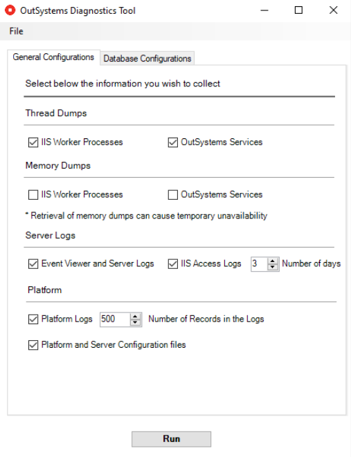

# OSDiagTool - OutSystems Support Diagnostics Tool

## Introduction

While troubleshooting process of a support case, one of our support engineers might ask you to obtain system information and logs of your Windows server. In order to ease up the process of collecting the necessary information, you can use OSDiagTool (.NET). You can also collect this information before requesting assistance and send it through the case.

## How to execute the tool?

1. Download [here](https://github.com/OutSystems/techsupp-osdiagtool/releases) the latest stable release.

1. Decompress the ZIP file and double-click the `OSDiagTool.exe` file (it runs as Administrator).

1. On the General configurations tab, you can select the information that will be exported.

    

    Only collect memory dumps if this information was requested by the Support engineer. Collecting memory dumps increases the tool execution time and causes a temporary unavailability of the applications in the respective application pool.

    

    
1. On the Database configurations, you can add/remove tables of the Platform Server metamodel and export them. For database troubleshooting, it's necessary to use database credentials that can query system tables (Oracle and SQL Server).

    _Note:_ Test the connection of the database user before running the tool.
    
1. Send the generated ZIP file to OutSystems Support.

Below you can find the **General Configurations** and **Database Configurations** tab:

## Configuration file

OSDiagTool has a configuration file with the configurations that are loaded when it's opened. An example of the configuration file of the OsDiagTool can be found below:

* IIS LogsNumberOfDays: the tool will only fetch the IIS access logs that are within the date range specified, i.e., (date time of OsDiagTool execution - LogsNumberOfDays);

* Information retrieved from the database: the table contents retrieved are listed on the `<databaseTables>`, `<ossys>` and `<osltm>` XML elements;
    * The tables with prefix OSSYS will always be retrieved;
    * The tables with prefix OSLTM will only be retrieved if it's a LifeTime environment;
    * Only OutSystems system tables are retrieved from the database. The tool won't retrieve any data related to your application tables;

* The support engineer may send you a customized version of the configuration file (`OSDGT.exe.config` file) in case it's necessary to retrieve additional information. In this case, you should replace the existent configuration file with the provided file and execute the tool.

## Output

The tool generates a ZIP file with all the collected information. You can find the following information in this compressed file:

* Event Viewer logs
* OutSystems services logs
* IIS configurations and access logs
* System information from the Registry (SSL Protocols, .NET Framework and IIS)
* OutSystems services thread dumps
* IIS Worker Processes thread dumps
* IIS Worker Processes memory dumps (optional)
* System database tables of the OutSystems platform
* IIS requests
* Database troubleshooting (such as high CPU queries, locks)
