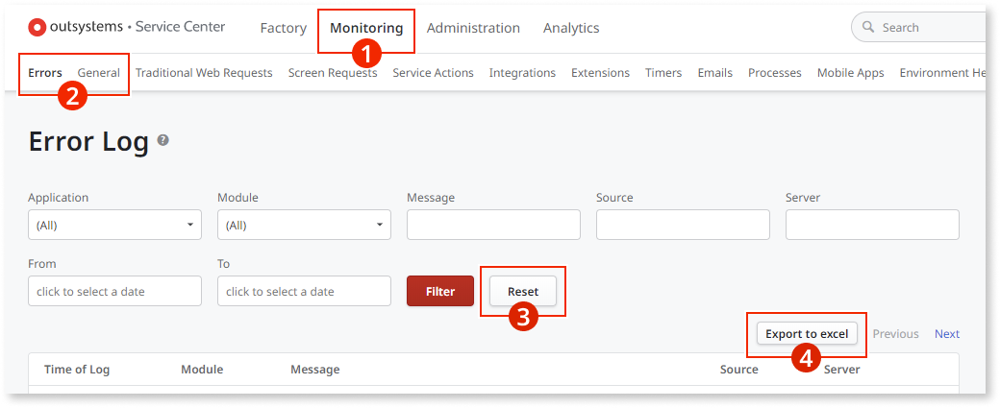

# Service Center logs

To get Service Center logs, follow these steps:

1. In the Service Center console of the environment you want to obtain the logs from (`https://<your_server>/ServiceCenter`), go to the **Monitoring** section.

1. Choose the type of logs you want to get (for example, **Errors** or **General**).

1. Click **Reset** to remove any potential filter.

1. Click **Export to excel** to save the file.

You can only view the last two weeks of logs in Service Center. Older logs are available directly in the database within the retention period. For detailed information, refer to [The rotation of logs](https://success.outsystems.com/documentation/11/monitoring_and_troubleshooting_apps/logging_database_and_architecture/the_log_tables_and_views/#the-rotation-of-the-logs).

