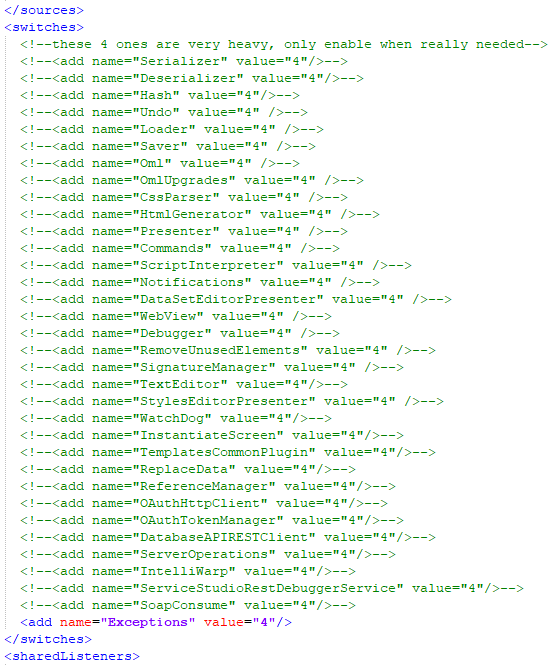

---
summary:
tags: 
locale: en-us
guid: f8cdaea8-0cdd-4466-830e-8bcf9d4ac8e7
app_type: traditional web apps, mobile apps, reactive web apps
platform-version: o11
---

# Service Studio logs

## Service Studio report

When an unexpected error occurs in Service Studio, you'll get an **Unexpected Error** window. In this window, you can obtain the error report to send to OutSystems Support.

To get the Service Studio report, follow these steps:

1. Click **You can help us fix this…** to expand the window, if it’s not expanded.

     

1. Click **View diagnostics report** to open the report in a text editor. In OutSystems 10, use the link **View report**.

     

1. Save the report as a text file. If you need help from OutSystems support but you don’t have an open support case yet, you can use the link **open a support case** to go to Support Portal.

1. Click **Continue** to close the window. In OutSystems 10, use the link **Cancel**.

## Enhanced logging in Service Studio

You may benefit from enhanced logging in Service Studio if the **Diagnostics Report** obtained in the previous section does not contain enough information. 

### Service Studio cross-platform versions 11.50.x and above

To enable the enhanced logging in Service Studio, follow these steps:

1. Ensure Service Studio is closed before editing the following file, so that settings are not overwritten when Service Studio is closed.

1. Edit the file `Settings.xml` at `%USERPROFILE%\AppData\Local\OutSystems\ServiceStudio 11 XPlatform Stable`

1. Edit the line for `SystemDiagnosticsSwitches` to include a comma-separated list of the desired switches (see list after steps), or use a * to turn them all on.
Example: `<SystemDiagnosticsSwitches>Presenter,Debugger</SystemDiagnosticsSwitches>`

1. Edit the line for `SystemDiagnosticsListenerFile` to include a path to which Service Studio can write.
Example: `<SystemDiagnosticsListenerFile>C:\Windows\Temp\ss_logs.txt</SystemDiagnosticsListenerFile>`

1. Replace the file path `C:\Windows\Temp\ss_logs.txt` with the desired path.

1. Start Service Studio in Administrator mode and reproduce the issue before gathering the logs.

 Click the toggle to learn about some known available switches.

* Commands
* CssParser
* DataSetEditorPresenter
* Debugger
* DebuggerEventsThread
* DebuggerPayloadExtensions
* DebuggerPayloadToXmlExtensions
* DebuggerService
* Deserializer
* Exceptions
* Hash
* IdentityServiceAuthentication
* IdentityServiceAuthenticationCommandLine
* InstantiateScreen
* IntelliWarp
* Loader
* MemoryWatcher
* Merge
* Presenter
* ReferenceManager
* RemoveUnusedElements
* ReplaceData
* Saver
* Serializer
* SignatureManager
* SoapConsume
* StylesEditorPresenter
* Telemetry
* TelemetrySwitch
* UIEditorPerformance
* Undo

### Service Studio cross-platform 11.14.16 and older versions

To enable the enhanced logging on older Service Studio versions, ensure the following:

1. Ensure that Service Studio is closed **before** editing the following file. Also make sure that no character is manipulated besides the indicated section. Note that even changing a letter to caps may make Service Studio fail to launch.

2. Edit the file `ServiceStudio.exe.config` located inside the installation folder of the Development Environment (example: `C:\Program Files\OutSystems\Development Environment X.X\Service Studio`).

3. Search for the section **switches** and uncomment all the lines that correspond to switches. To achieve this, you can delete the characters `<!--` that are in the beginning of each line and the characters `-->` at the end of the line.

4. Alternatively, if you use Notepad++, you can select all the relevant lines and click **Edit** >  **Comment/Uncomment** > **Toggle Single Line Comment**. You can also use the shortcut keys `Ctrl+Q`. 
The section should then look like this.

5. To generate the logs, Service Studio must be launched as an Administrator.

6. The logs will be written to a file named `general.txt`, located in the same folder of the `ServiceStudio.exe.config` file (example: `C:\Program Files\OutSystems\Development Environment X.X\Service Studio`).

Remember to disable the additional logging again after replicating the issue and collecting logs as `general.txt` file can grow in size very quickly.

